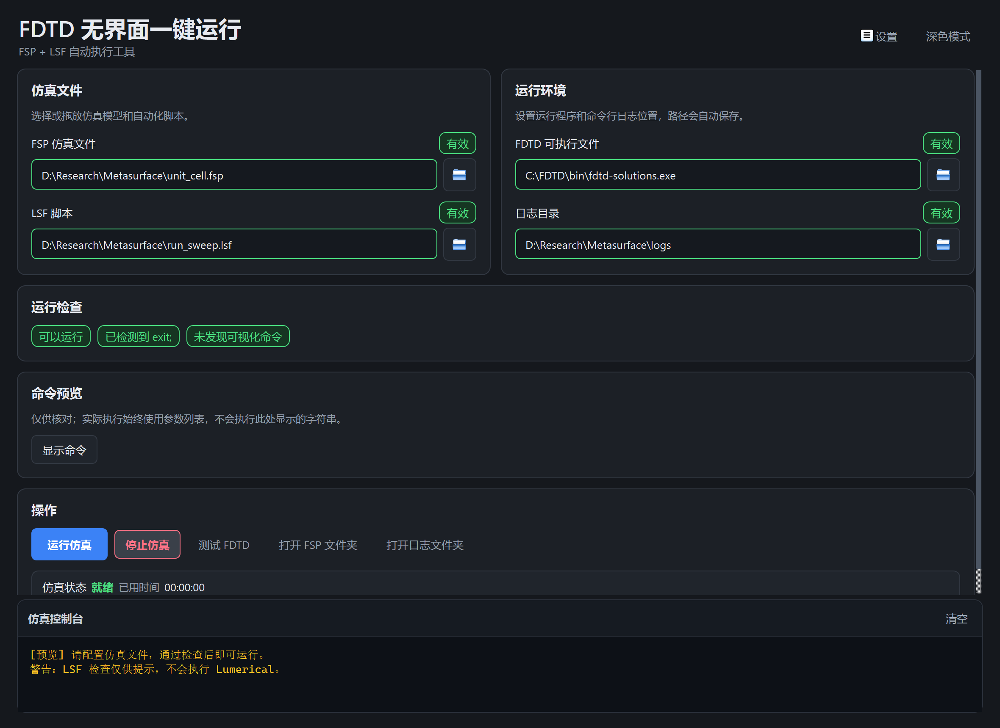
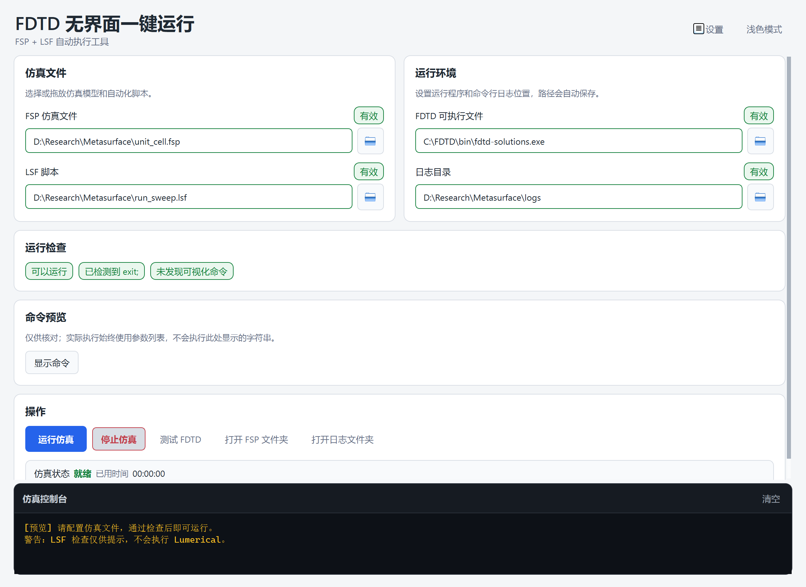
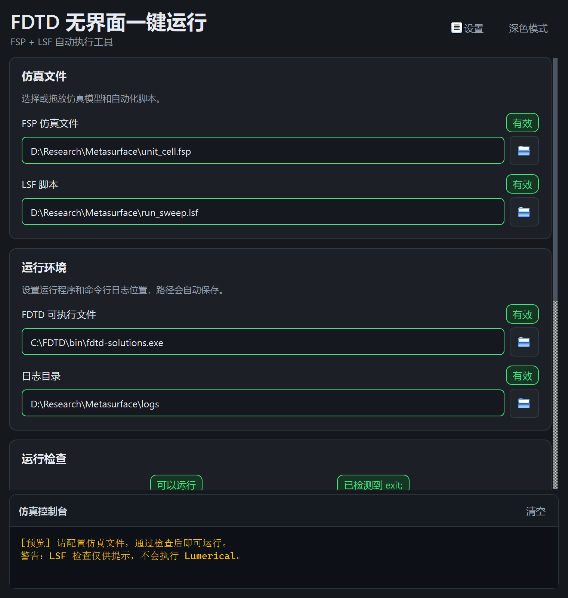

<p align="center">
  
</p>

<h1 align="center">FDTD 无界面一键运行</h1>

<p align="center">
  面向 Windows 科研环境的 FSP + LSF 自动执行工具
</p>

> [!IMPORTANT]
> 本项目是独立开发的非官方工具，与 Ansys, Inc. 及其关联公司不存在隶属、授权或背书关系。Ansys、Lumerical 及相关产品名称和商标归其各自权利人所有；本文仅为说明软件兼容对象而提及。

## 项目简介

本工具用于在 Windows 上调用本机已安装的 `fdtd-solutions.exe`，以无界面方式执行一个 `.fsp` 仿真文件和一个 `.lsf` 脚本。

它解决的是重复启动、路径管理、实时输出和进程停止问题，不负责创建或修改仿真模型，也不会改变 LSF 脚本自身的数据导出行为。

## 界面预览

暗色主题：



<details>
<summary>查看亮色主题和窄窗口布局</summary>





</details>

## 功能特性

- 中文 PySide6 桌面界面，支持浅色/深色主题与 Windows HiDPI；
- 宽窗口双栏、窄窗口单栏，操作按钮和状态区域自动重排；
- 自动恢复上一次使用的 FDTD、FSP、LSF 和日志目录；
- 保存路径失效或首次启动时，自动检测常见 Ansys/Lumerical 安装位置；
- 支持文件选择、拖放和中文、空格、`&`、括号等 Windows 路径；
- 实时检查 executable、FSP、LSF 和日志目录；
- 提示 LSF 中是否包含 `exit;` 或可视化命令；
- 可折叠命令预览和一键复制；
- 后台运行仿真，GUI 主线程不会因长时间任务卡死；
- 实时显示合并后的 stdout/stderr，同时保留 FDTD 原有日志写入机制；
- 显示运行状态、已用时间和不确定进度；
- 只停止本工具启动的 PID 及其子进程树，不按进程名批量结束其他 FDTD；
- 使用 `QSettings` 保存路径、主题、窗口大小和分隔栏位置。

## 系统要求

- Windows 10 或 Windows 11；
- 已正确安装并获得授权的 Ansys Lumerical FDTD；
- 能够在本机找到 `fdtd-solutions.exe`；
- 从源码运行时需要 Python 3.10 或更高版本。

本项目不包含、分发或绕过 Lumerical 软件及许可证。

## 快速开始

### 使用打包版

1. 在 GitHub 仓库的 **Releases** 页面下载发布包。
2. 解压到当前用户可写的目录，不建议直接放入 `Program Files`。
3. 双击：

   ```text
   FDTD无界面一键运行.exe
   ```

4. 程序会先恢复上次使用的 FDTD 路径；路径无效时会自动检测，仍未找到再手动选择。
5. 选择或拖入 `.fsp` 和 `.lsf` 文件，设置日志目录后点击 **运行仿真**。

程序设置保存在 EXE 同目录的 `settings.ini`。升级时可以替换 EXE，并保留该文件继续使用原配置。

### 校验下载文件

发布包提供 `SHA256.txt`。可以在 PowerShell 中运行：

```powershell
Get-FileHash -Algorithm SHA256 -LiteralPath ".\FDTD无界面一键运行.exe"
Get-Content ".\SHA256.txt"
```

两处哈希应当一致。

## 从源码运行

```powershell
git clone <你的仓库地址>
cd <仓库目录>

python -m venv .venv
.\.venv\Scripts\python.exe -m pip install -r .\requirements.txt
.\.venv\Scripts\python.exe .\lumerical_runner_zh.py
```

项目仅使用 PySide6 构建界面，没有引入商业 UI 组件。

## 使用说明

1. **FDTD 可执行文件**：选择 `fdtd-solutions.exe`。
2. **FSP 仿真文件**：选择本次需要运行的 `.fsp`。
3. **LSF 脚本**：选择负责自动化操作和数据导出的 `.lsf`。
4. **日志目录**：用于 `-logall -o` 对应的 Lumerical 命令行日志。
5. 在 **运行检查** 中确认路径和脚本提示。
6. 必要时展开 **命令预览** 核对参数，再点击 **运行仿真**。

> [!CAUTION]
> 程序会使用 `-trust-script`。LSF 脚本可能读写文件或执行其他自动化操作，请只运行来源可信且已经检查过的脚本。

## FDTD 调用行为

实际参数列表及顺序为：

```text
fdtd-solutions.exe
-nw
-trust-script
-logall
-o
<日志目录>
-run
<脚本.lsf>
<仿真.fsp>
```

运行时还保持以下行为：

- 工作目录为 FSP 文件所在目录；
- 使用 Python 参数列表和 `shell=False`，不拼接未经转义的 shell 命令；
- `stdin` 使用 `DEVNULL`；
- stdout/stderr 合并并实时发送到界面控制台；
- LSF 生成的 TXT、MAT、FSP 等输出仍完全由脚本控制。

## 停止机制

Windows 下只对本工具记录的当前 PID 调用：

```text
taskkill /PID <pid> /T /F
```

如果该操作未完成，再对同一进程对象依次执行 `terminate` 和超时后的 `kill`。程序不会按 `fdtd-solutions.exe` 名称批量结束其他仿真实例。

## 配置与隐私

- `settings.ini`：保存路径、主题和窗口布局，运行后自动生成；
- `settings.json`：旧版本配置，首次启动时可迁移；
- 本工具不上传仿真文件、脚本、日志或路径；
- 本工具不包含遥测或在线账户功能。

提交 Issue 前请检查截图和日志，避免公开许可证信息、用户名、项目绝对路径或未公开的科研数据。

## 工程结构

```text
assets/                  应用图标源文件和 ICO
docs/images/             README 截图
scripts/                 图标及截图生成脚本
tests/                   核心、进程、配置和 GUI 测试
fdtd_core.py             参数构造、验证、LSF 检查和 FDTD 自动发现
fdtd_runner.py           与 QWidget 解耦的后台进程运行器
main_window.py           PySide6 主窗口和交互状态
widgets.py               路径输入、状态标签、命令预览和控制台
styles.py                浅色/深色 QSS
settings_store.py        QSettings 持久化和旧配置迁移
lumerical_runner_zh.py   程序入口及打包自检
build_exe.ps1            Windows EXE 构建脚本
```

## 测试

以下测试不会启动 FDTD，也不会占用许可证：

```powershell
.\.venv\Scripts\python.exe -m unittest discover -s .\tests -v
.\.venv\Scripts\python.exe .\lumerical_runner_zh.py --self-test
.\.venv\Scripts\python.exe .\lumerical_runner_zh.py --gui-smoke-test
```

当前测试覆盖命令参数顺序、中文和特殊字符路径、FDTD 自动发现、LSF 提示、配置迁移、文件选择、响应式布局、GUI 状态、stdout/stderr 及进程树停止。

## 构建 Windows EXE

```powershell
powershell -ExecutionPolicy Bypass -File .\build_exe.ps1
```

构建脚本会：

1. 在项目的 `.build-venv` 中安装 PySide6 和 PyInstaller；
2. 从项目 SVG 生成多分辨率 Windows ICO；
3. 生成单文件窗口程序；
4. 将现有 README 截图复制到发布目录并更新 SHA-256 文件；
5. 输出到：

   ```text
   release\FDTD无界面一键运行.exe
   ```

完整发布步骤见 [发布检查清单](docs/RELEASE_CHECKLIST.md)。

## 常见问题

### 自动检测不到 FDTD

点击路径输入框右侧的文件夹按钮，手动选择安装目录中的 `fdtd-solutions.exe`。自动检测只检查环境变量、`PATH` 和常见安装位置，不会递归扫描整块硬盘。

### LSF 没有 `exit;` 能否运行

可以。该检查只是提示，不会修改或拒绝脚本。但脚本完成后，FDTD 进程可能继续存在，需要手动停止。

### 数据文件为什么没有出现在日志目录

日志目录只对应 `-logall -o`。LSF 生成的数据文件位置由脚本内容和 FSP 工作目录决定。

### 更新 EXE 后仍显示旧图标

Windows Explorer 可能缓存旧文件名对应的图标。优先使用发布包中的新文件名；仍未刷新时，可以重启 Explorer 或清理 Windows 图标缓存。

## 名称、图标与第三方许可

- “FDTD 无界面一键运行”是功能描述性名称；
- 应用图标由本项目原创，源文件为 `assets/fdtd_runner_icon.svg`；
- 文件夹等界面图标来自 Qt 标准系统图标；
- PySide6/Qt for Python 的使用受其自身许可证约束；
- 本次整理没有替仓库选择源代码许可证。公开发布前，请根据你的授权意图在仓库根目录添加合适的 `LICENSE`。

## 验证边界

单元测试、自检和 GUI smoke test 只验证程序结构、参数、界面和进程管理，不等同于完成一次真实 FDTD 仿真。许可证可用性、FSP 模型和 LSF 脚本在具体 Lumerical 版本中的运行结果，需要在实际科研环境中单独确认。
